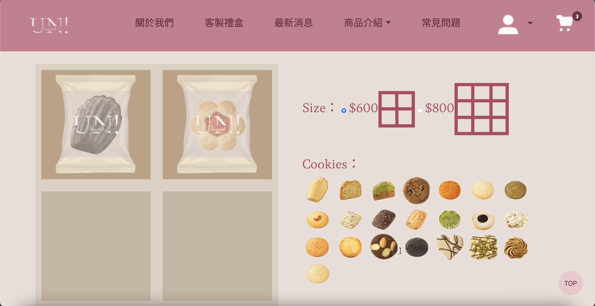

# unidessert customise biscuit



## Description

This project, built with EJS, Node.js, and MySQL, allows users to place orders for cookies and customize cookie gift boxes.


## Technologies Used

- EJS for templating
- Node.js for the server
- MySQL for the database

## Getting Started

To get started, follow these steps:

1. Clone the repository:

   ```bash
   git clone https://github.com/yourusername/cookie-ordering-system.git
   ```

   Install dependencies:

   ```bash
   npm i
   ```

2. Set up the MySQL database

3. Run the server
   ```bash
   node index.js
   ```
4. Open your browser and go to http://localhost:5678 to access the website.

## Database Schema

```sql
   -- phpMyAdmin SQL Dump
   -- version 5.2.1
   -- https://www.phpmyadmin.net/

   SET SQL_MODE = "NO_AUTO_VALUE_ON_ZERO";
   START TRANSACTION;
   SET time_zone = "+00:00";

   CREATE TABLE `customize` (
   `cid` int(11) NOT NULL,
   `ctype` varchar(2) DEFAULT NULL,
   `cname` varchar(12) DEFAULT NULL,
   `cpic` varchar(25) DEFAULT NULL,
   `cpic2` varchar(27) DEFAULT NULL,
   `cprice2` int(11) DEFAULT NULL,
   `cstock` int(11) DEFAULT NULL,
   `cstatus` varchar(1) DEFAULT NULL
   ) ENGINE=InnoDB DEFAULT CHARSET=utf8mb4 COLLATE=utf8mb4_general_ci;

   INSERT INTO `customize` (`cid`, `ctype`, `cname`, `cpic`, `cpic2`, `cprice2`, `cstock`, `cstatus`) VALUES
   (1, '紙盒', '紅色紙盒', '/pic/customize/box1.png', '/pic/customize/Color1.png', 0, 10, 'y'),
   (2, '紙盒', '橘色紙盒', '/pic/customize/box2.png', '/pic/customize/Color2.png', 0, 10, 'y'),
   (3, '紙盒', '綠色紙盒', '/pic/customize/box3.png', '/pic/customize/Color3.png', 0, 10, 'y'),
   (4, '紙盒', '藍色紙盒', '/pic/customize/box4.png', '/pic/customize/Color4.png', 0, 10, 'y'),
   (5, '紙盒', '紫色紙盒', '/pic/customize/box5.png', '/pic/customize/Color5.png', 0, 10, 'y'),
   (6, '紙盒', '黑紅紙盒', '/pic/customize/box6.png', '/pic/customize/Color6.png', 0, 10, 'y'),
   (7, '紙盒', '藍橘紙盒', '/pic/customize/box7.png', '/pic/customize/Color7.png', 0, 10, 'y'),
   (8, '紙盒', '綠黃紙盒', '/pic/customize/box8.png', '/pic/customize/Color8.png', 0, 10, 'y'),
   (9, '紙盒', '藍白紙盒', '/pic/customize/box9.png', '/pic/customize/Color9.png', 0, 10, 'y'),
   (10, '紙盒', '紫黑紙盒', '/pic/customize/box10.png', '/pic/customize/Color10.png', 0, 10, 'y'),
   (11, '紙袋', '紅色紙袋', '/pic/customize/bag11.png', '/pic/customize/Color1.png', 0, 10, 'y'),
   (12, '紙袋', '橘色紙袋', '/pic/customize/bag12.png', '/pic/customize/Color2.png', 0, 10, 'y'),
   (13, '紙袋', '綠色紙袋', '/pic/customize/bag13.png', '/pic/customize/Color3.png', 0, 10, 'y'),
   (14, '紙袋', '藍色紙袋', '/pic/customize/bag14.png', '/pic/customize/Color4.png', 0, 10, 'y'),
   (15, '紙袋', '紫色紙袋', '/pic/customize/bag15.png', '/pic/customize/Color5.png', 0, 10, 'y'),
   (16, '餅乾', '瑪德蓮', '/pic/customize/cake1.png', '/pic/customize/cake1-2.jpg', 0, 10, 'y'),
   (17, '餅乾', '巧克力瑪德蓮', '/pic/customize/cake2.png', '/pic/customize/cake2-2.jpg', 0, 10, 'y'),
   (18, '餅乾', '伯爵紅茶磅蛋糕', '/pic/customize/cake3.png', '/pic/customize/cake3-2.jpg', 0, 10, 'y'),
   (19, '餅乾', '抹茶磅蛋糕', '/pic/customize/cake4.png', '/pic/customize/cake4-2.jpg', 0, 10, 'y'),
   (20, '餅乾', '軟餅乾', '/pic/customize/cake5.png', '/pic/customize/cake5-2.jpg', 0, 10, 'y'),
   (21, '餅乾', '匈牙利紅椒起司餅乾(鹹)', '/pic/customize/cake6.png', '/pic/customize/cake6-2.jpg', 0, 10, 'y'),
   (22, '餅乾', '皇家伯爵茶圓餅', '/pic/customize/cake7.png', '/pic/customize/cake7-2.jpg', 0, 10, 'y'),
   (23, '餅乾', '靜岡焙茶白巧克力厚餅', '/pic/customize/cake8.png', '/pic/customize/cake8-2.jpg', 0, 10, 'y'),
   (24, '餅乾', '黑糖海鹽酥餅', '/pic/customize/cake9.png', '/pic/customize/cake9-2.jpg', 0, 10, 'y'),
   (25, '餅乾', '黑芝麻法國小餅', '/pic/customize/cake10.png', '/pic/customize/cake10-2.jpg', 0, 10, 'y'),
   (26, '餅乾', '巧克力杏仁餅乾', '/pic/customize/cake11.png', '/pic/customize/cake11-2.jpg', 0, 10, 'y'),
   (27, '餅乾', '蔓越莓方餅', '/pic/customize/cake12.png', '/pic/customize/cake12-2.jpg', 0, 10, 'y'),
   (28, '餅乾', '香草抹茶沙布蕾', '/pic/customize/cake13.png', '/pic/customize/cake13-2.jpg', 0, 10, 'y'),
   (29, '餅乾', '藍莓杏仁沙布蕾', '/pic/customize/cake14.png', '/pic/customize/cake14-2.jpg', 0, 10, 'y'),
   (30, '餅乾', '加斯科涅‧ 雲朵脆餅', '/pic/customize/cake15.png', '/pic/customize/cake15-2.jpg', 0, 10, 'y'),
   (31, '餅乾', '洋蔥番茄鹹餅乾(鹹)', '/pic/customize/cake16.png', '/pic/customize/cake16-2.jpg', 0, 10, 'y'),
   (32, '餅乾', '布列塔尼酥餅', '/pic/customize/cake17.png', '/pic/customize/cake17-2.jpg', 0, 10, 'y'),
   (33, '餅乾', '果醬餅乾', '/pic/customize/cake18.png', '/pic/customize/cake18-2.jpg', 0, 10, 'y'),
   (34, '餅乾', '巧克力杏仁餅乾', '/pic/customize/cake19.png', '/pic/customize/cake19-2.jpg', 0, 10, 'y'),
   (35, '餅乾', '巧克力鹽之花', '/pic/customize/cake20.png', '/pic/customize/cake20-2.jpg', 0, 10, 'y'),
   (36, '餅乾', '巧克力（七夕限定）', '/pic/customize/cake21.png', '/pic/customize/cake21-2.jpg', 0, 10, 'y'),
   (37, '餅乾', '白巧克力佐開心果', '/pic/customize/cake22.png', '/pic/customize/cake22-2.jpg', 0, 10, 'y'),
   (38, '餅乾', '焦糖海鹽曲奇', '/pic/customize/cake23.png', '/pic/customize/cake23-2.jpg', 0, 10, 'y'),
   (39, '餅乾', '皇家伯爵茶圓餅', '/pic/customize/cake24.png', '/pic/customize/cake24-2.jpg', 0, 10, 'y'),
   (40, '大小', '四格', '/pic/customize/4.png', '', 600, 10, 'y'),
   (41, '大小', '九格', '/pic/customize/9.png', '', 800, 10, 'y');

   CREATE TABLE `c_detail2` (
   `cdetailid` int(11) NOT NULL,
   `size` varchar(30) DEFAULT NULL,
   `cookie1` varchar(30) DEFAULT NULL,
   `cookie2` varchar(30) DEFAULT NULL,
   `cookie3` varchar(30) DEFAULT NULL,
   `cookie4` varchar(30) DEFAULT NULL,
   `boxcolor` varchar(30) DEFAULT NULL,
   `bagcolor` varchar(30) DEFAULT NULL,
   `cardcontent` varchar(300) DEFAULT NULL,
   `quantity2` int(11) DEFAULT NULL,
   `cprice` varchar(20) DEFAULT NULL
   ) ENGINE=InnoDB DEFAULT CHARSET=utf8mb4 COLLATE=utf8mb4_general_ci;


   INSERT INTO `c_detail2` (`cdetailid`, `size`, `cookie1`, `cookie2`, `cookie3`, `cookie4`, `boxcolor`, `bagcolor`, `cardcontent`, `quantity2`, `cprice`) VALUES
   (169, '四格 ', '伯爵紅茶磅蛋糕', '瑪德蓮', '巧克力瑪德蓮', '軟餅乾', '綠黃紙盒', '藍色紙袋', '老婆生日快樂', 1, '600'),
   (170, '四格 ', '伯爵紅茶磅蛋糕', '瑪德蓮', '巧克力瑪德蓮', '軟餅乾', '綠黃紙盒', '藍色紙袋', '老婆生日快樂', 1, '600'),
   (171, '四格 ', '巧克力瑪德蓮', '伯爵紅茶磅蛋糕', '瑪德蓮', '抹茶磅蛋糕', '藍白紙盒', '綠色紙袋', '老婆情人節快樂', 1, '600'),
   (172, '四格 ', '巧克力瑪德蓮', '伯爵紅茶磅蛋糕', '瑪德蓮', '抹茶磅蛋糕', '藍白紙盒', '綠色紙袋', '老婆情人節快樂', 1, '600'),
   (174, '四格 ', '巧克力瑪德蓮', '果醬餅乾', '巧克力杏仁餅乾', '瑪德蓮', '綠色紙盒', '藍色紙袋', 'good', 1, '600'),
   (178, '四格 ', '巧克力瑪德蓮', '瑪德蓮', '抹茶磅蛋糕', '軟餅乾', '藍色紙盒', '綠色紙袋', 'nice', 1, '600'),
   (180, '四格 ', '巧克力瑪德蓮', '瑪德蓮', '抹茶磅蛋糕', '軟餅乾', '藍色紙盒', '綠色紙袋', 'nice', 1, '600'),
   (182, '四格 ', '巧克力瑪德蓮', '瑪德蓮', '抹茶磅蛋糕', '軟餅乾', '藍色紙盒', '綠色紙袋', 'nice', 1, '600'),
   (185, '四格 ', '靜岡焙茶白巧克力厚餅', '果醬餅乾', '香草抹茶沙布蕾', '巧克力杏仁餅乾', '綠色紙盒', '藍色紙袋', '謝謝', 1, '600'),
   (187, '四格 ', '抹茶磅蛋糕', '果醬餅乾', '巧克力杏仁餅乾', '藍莓杏仁沙布蕾', '綠色紙盒', '藍色紙袋', '謝謝', 1, '600'),
   (188, '四格 ', '瑪德蓮', '果醬餅乾', '巧克力杏仁餅乾', '白巧克力佐開心果', '綠色紙盒', '藍色紙袋', '謝謝', 1, '600'),
   (189, '四格 ', '瑪德蓮', '果醬餅乾', '巧克力杏仁餅乾', '白巧克力佐開心果', '綠色紙盒', '藍色紙袋', '謝謝', 1, '600'),
   (190, '四格 ', '伯爵紅茶磅蛋糕', '瑪德蓮', '巧克力瑪德蓮', '抹茶磅蛋糕', '藍色紙盒', '綠色紙袋', '謝謝', 1, '600'),
   (191, '四格 ', '伯爵紅茶磅蛋糕', '瑪德蓮', '巧克力瑪德蓮', '抹茶磅蛋糕', '藍色紙盒', '綠色紙袋', '謝謝', 1, '600'),
   (197, '四格 ', '巧克力瑪德蓮', '果醬餅乾', '香草抹茶沙布蕾', '藍莓杏仁沙布蕾', '綠色紙盒', '藍色紙袋', '希望你會喜歡', 1, '600'),
   (199, '四格 ', '巧克力杏仁餅乾', '黑糖海鹽酥餅', '果醬餅乾', '白巧克力佐開心果', '綠色紙盒', '藍色紙袋', '希望你會喜歡', 1, '600');

   CREATE TABLE `oderdetails` (
   `orderdetails_id` int(11) NOT NULL,
   `oid` int(11) NOT NULL,
   `product_type` varchar(10) NOT NULL,
   `product_id` int(11) NOT NULL,
   `p_name` varchar(30) NOT NULL,
   `quantity` int(11) NOT NULL,
   `total_price` int(11) NOT NULL,
   `cdetailid` int(11) DEFAULT NULL
   ) ENGINE=InnoDB DEFAULT CHARSET=utf8mb4 COLLATE=utf8mb4_general_ci;

   CREATE TABLE `orderlist` (
   `oid` int(11) NOT NULL,
   `uid` int(11) NOT NULL,
   `deliever_fee` int(11) NOT NULL,
   `order_total` int(11) NOT NULL,
   `order_date` date NOT NULL DEFAULT current_timestamp(),
   `recipient` varchar(10) NOT NULL,
   `recipient_address` varchar(20) NOT NULL,
   `recipient_phone` varchar(12) NOT NULL,
   `recipient_email` varchar(25) NOT NULL,
   `arrive_date` date NOT NULL DEFAULT current_timestamp(),
   `payment_type` varchar(10) NOT NULL,
   `order_status` varchar(25) NOT NULL
   ) ENGINE=InnoDB DEFAULT CHARSET=utf8mb4 COLLATE=utf8mb4_general_ci;

   CREATE TABLE `product` (
   `pid` int(11) NOT NULL,
   `pd_name` varchar(25) NOT NULL,
   `p_price` int(11) NOT NULL,
   `pd_content` varchar(100) NOT NULL,
   `pd_describe_contents` varchar(150) NOT NULL,
   `pd_describe_specification` varchar(20) NOT NULL,
   `p_pic` varchar(100) NOT NULL,
   `p_pic2` varchar(100) NOT NULL,
   `p_pic3` varchar(100) NOT NULL,
   `p_pic4` varchar(100) NOT NULL,
   `p_type` varchar(10) NOT NULL,
   `pd_takeoff` date DEFAULT NULL,
   `pd__update` date DEFAULT NULL
   ) ENGINE=InnoDB DEFAULT CHARSET=utf8mb4 COLLATE=utf8mb4_unicode_ci;

   INSERT INTO `product` (`pid`, `pd_name`, `p_price`, `pd_content`, `pd_describe_contents`, `pd_describe_specification`, `p_pic`, `p_pic2`, `p_pic3`, `p_pic4`, `p_type`, `pd_takeoff`, `pd__update`) VALUES
   (1, '彤粉情人節禮盒', 768, '撞色美學與法式時尚花框的優雅邂逅。\r\n內含點心品項 11 入，包括 2 入 法式點心、8 入手工餅乾以及脆餅 1 包', '蜂蜜杏仁瑪德蓮、安貝栗子烏龍 · 達克瓦茲、咖啡奶酥曲奇、\r\n巧克力杏仁餅乾、皇家伯爵茶圓餅、黑芝麻法國小餅、\r\n蔓越莓方餅、檸檬三重奏、匈牙利紅椒起司餅乾(鹹、\r\n香草抹茶沙布蕾、加斯科涅· 雲朵脆餅', '彤粉情人節精裝禮盒', '/pic/product/pd1_pic1.png', '/pic/product/pd1_pic2.png', '/pic/product/pd1_pic3.png', '/pic/product/pd1_pic4.png', 'set', '2023-08-31', '2023-06-01'),
   (2, '湛藍情人節禮盒', 798, '撞色美學與法式時尚花框的優雅邂逅，搭配細緻優雅的新古典線條', '蜂蜜杏仁瑪德蓮、 安貝栗子烏龍 · 達克瓦茲\r\n咖啡奶酥曲奇、 巧克力杏仁餅乾\r\n皇家伯爵茶圓餅、 黑芝麻法國小餅\r\n蔓越莓方餅、 檸檬三重奏\r\n匈牙利紅椒起司餅乾(鹹)、 香草抹茶沙布蕾\r\n加斯科涅', '湛藍情人節精裝禮盒', '/pic/product/pd2_pic1.png', '/pic/product/pd2_pic2.png', '/pic/product/pd2_pic3.png', '/pic/product/pd2_pic4.png', 'set', '2023-08-31', '2023-06-01'),
   (3, '蘋果樹磅蛋糕', 50, '', '', '', '/pic/product/green_poundcake.webp', '', '', '', 'single', '2023-08-31', '2023-06-01'),
   (4, '伯爵檸檬磅蛋糕', 55, '', '', '', '/pic/product/lemon_poundcake.webp', '', '', '', 'single', '2023-08-31', '2023-06-01'),
   (5, '可可瑪德蓮', 55, '', '', '', '/pic/product/cocomadeleine.webp', '', '', '', 'single', '2023-08-31', '2023-06-01'),
   (6, '咖啡奶酥曲奇', 15, '', '', '', '/pic/product/coffee_cookie.webp', '', '', '', 'single', '2023-08-31', '2023-06-01'),
   (7, '布列塔尼酥餅', 30, '', '', '', '/pic/product/bretagne.webp', '', '', '', 'single', '2023-08-31', '2023-06-01'),
   (8, '香草抹茶沙布蕾', 40, '', '', '', '/pic/product/mocha.webp', '', '', '', 'single', '2023-08-31', '2023-06-01'),
   (9, '焙茶白巧厚餅', 30, '', '', '', '/pic/product/Hojicha_cookie.webp', '', '', '', 'single', '2023-08-31', '2023-06-01'),
   (10, '巧克力杏仁餅乾', 25, '', '', '', '/pic/product/chocolate_almond.webp', '', '', '', 'single', '2023-08-31', '2023-06-01'),
   (11, '黑糖海鹽酥餅', 29, '', '', '', '/pic/product/brown_sugar.webp', '', '', '', 'single', '2023-08-31', '2023-06-01'),
   (12, '巧克力鹽之花', 40, '', '', '', '/pic/product/chocolate_salt.webp', '', '', '', 'single', '2023-08-31', '2023-06-01'),
   (13, '雲朵脆餅', 50, '', '', '', '/pic/product/cloud_cookie.webp', '', '', '', 'single', '2023-08-31', '2023-06-01'),
   (14, '蔓越莓方餅', 40, '', '', '', '/pic/product/cranberry_cookie.webp', '', '', '', 'single', '2023-08-31', '2023-06-01'),
   (15, '法式菱格紋禮盒', 938, '', '', '', '/pic/product/pd3_pic1.png', '', '', '', 'set', '2023-08-31', '2023-06-01'),
   (16, '金緻紅禮盒', 890, '', '', '', '/pic/product/pd4_pic1.png', '', '', '', 'set', '2023-08-31', '2023-06-01'),
   (17, '戀人絮語禮盒', 768, '', '', '', '/pic/product/pd5_pic1.png', '', '', '', 'set', '2023-08-31', '2023-06-01'),
   (18, '餅乾盅禮盒', 390, '', '', '', '/pic/product/pd6_pic1.png', '', '', '', 'set', '2023-08-31', '2023-06-01'),
   (19, '深緋禮盒', 938, '', '', '', '/pic/product/pd7_pic1.png', '', '', '', 'set', '2023-08-31', '2023-06-01'),
   (20, '星芒禮盒', 858, '', '', '', '/pic/product/pd5_pic1.png', '', '', '', 'set', '2023-08-31', '2023-06-01');

   CREATE TABLE `user` (
   `uid` int(11) NOT NULL,
   `uname` varchar(20) NOT NULL,
   `umobile` varchar(15) NOT NULL,
   `uemail` varchar(30) NOT NULL,
   `upwd` varchar(300) NOT NULL,
   `ubirth` date DEFAULT NULL,
   `umembertime` datetime DEFAULT NULL
   ) ENGINE=InnoDB DEFAULT CHARSET=utf8mb4 COLLATE=utf8mb4_unicode_ci;

   INSERT INTO `user` (`uid`, `uname`, `umobile`, `uemail`, `upwd`, `ubirth`, `umembertime`) VALUES
   (17, '陳蘇珊', '', 'chensufei72@gmail.com', '$2b$10$qWumCq/Fy.Sd4b9zsz/eyeI98UH2.bVMerAlHki3DQAeibPDgKcze', NULL, '2023-07-25 17:07:52');

   ALTER TABLE `customize`
   ADD PRIMARY KEY (`cid`);

   ALTER TABLE `c_detail2`
   ADD PRIMARY KEY (`cdetailid`);

   ALTER TABLE `oderdetails`
   ADD PRIMARY KEY (`orderdetails_id`);

   ALTER TABLE `orderlist`
   ADD PRIMARY KEY (`oid`);

   ALTER TABLE `product`
   ADD PRIMARY KEY (`pid`);

   ALTER TABLE `user`
   ADD PRIMARY KEY (`uid`);

   ALTER TABLE `c_detail2`
   MODIFY `cdetailid` int(11) NOT NULL AUTO_INCREMENT, AUTO_INCREMENT=208;

   ALTER TABLE `oderdetails`
   MODIFY `orderdetails_id` int(11) NOT NULL AUTO_INCREMENT, AUTO_INCREMENT=566;

   ALTER TABLE `orderlist`
   MODIFY `oid` int(11) NOT NULL AUTO_INCREMENT, AUTO_INCREMENT=151;

   ALTER TABLE `product`
   MODIFY `pid` int(11) NOT NULL AUTO_INCREMENT, AUTO_INCREMENT=21;

   ALTER TABLE `user`
   MODIFY `uid` int(11) NOT NULL AUTO_INCREMENT, AUTO_INCREMENT=18;
   COMMIT;
```
